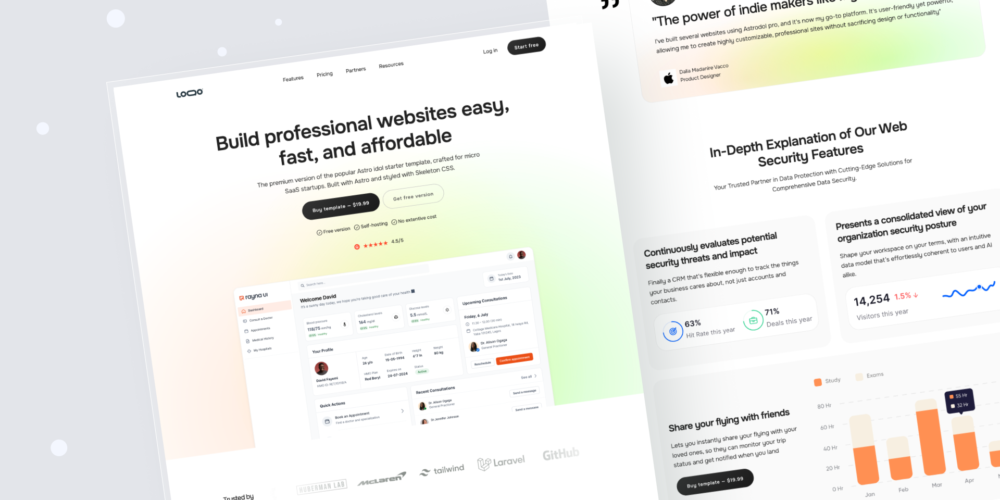

# Astro Idol pro version


The premium version of the popular Astro idol starter template, crafted for micro SaaS startups. Built with Astro and styled with Skeleton CSS.




## 🚀 Project Structure

Inside of your Astro project, you'll see the following folders and files:

```text
/
├── public/
│   └── favicon.svg
├── src/
│   ├── components/
│   │   └── Faq.astro
        └── Features.astro
        └── Footer.astro
        └── Header.astro
        └── Hero.astro
        └── PriceTable.astro
        └── SeenoN.astro
        └── Showcase.astro
        └── Testimony.astro
│   ├── layouts/
│   │   └── Layout.astro
│   └── pages/
│       └── index.astro
        └── pricing.astro
└── package.json
```

Astro looks for `.astro` or `.md` files in the `src/pages/` directory. Each page is exposed as a route based on its file name.

There's nothing special about `src/components/`, but that's where we like to put any Astro/React/Vue/Svelte/Preact components.

Any static assets, like images, can be placed in the `public/` directory.

## 🧞 Commands

All commands are run from the root of the project, from a terminal:

| Command                   | Action                                           |
| :------------------------ | :----------------------------------------------- |
| `npm install`             | Installs dependencies                            |
| `npm run dev`             | Starts local dev server at `localhost:4321`      |
| `npm run build`           | Build your production site to `./dist/`          |
|


## 👀 Curious to Explore More?

Check out [LAB-CH3](https://github.com/LaB-CH3) for a growing collection of current and future templates.
